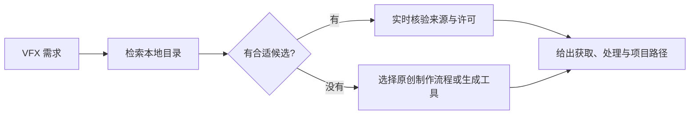

# Textures for VFX — Codex Skill

一个帮助 Codex **查找、核验、获取或规划原创 VFX 贴图资产**的个人 Skill。它把 Simon Trümpler 的公开 [Textures for VFX Database](https://simonschreibt.notion.site/Textures-for-VFX-Database-2c72eccccfa84a0eae927d778ad746cc) 整理成可离线检索的本地目录，并补充贴图、Flipbook、VDB、笔刷、实拍素材和程序化生成器的生产流程。

> 本仓库是资源索引与工作流，不是第三方资产镜像。仓库不包含数据库所链接的贴图、视频、VDB、笔刷或付费产品。

## 能做什么

- 按效果、风格、资源类型、作者和标签检索 VFX 资源。
- 支持火焰、烟雾、水花、闪电、魔法、冲击、噪声等中英文关键词。
- 区分可直接使用的资产、生成器、教程、论坛讨论和参考资料。
- 在采用候选项前核验当前价格、许可、署名要求、格式和工具兼容性。
- 为 Unity、Unreal、Houdini、Blender 或通用项目规划稳定的资产目录。
- 找不到合适资源时，转入程序化、手绘、Photobash 或模拟烘焙方案。

不适合用来查找通用 PBR 材质库，也不会绕过登录、付费、许可或下载限制。

## 工作方式



Skill 默认先搜索本地快照，避免无目的地浏览网页。只有准备采用某个资源时，才访问当前提供方页面进行实时核验。

## 目录概览

当前快照抓取于 2026-08-31：

| 指标 | 数量 |
|---|---:|
| 全部条目 | 264 |
| 带来源 URL | 263 |
| 教程 | 128 |
| 贴图包 | 43 |
| 生成器 | 31 |
| 笔刷包 | 27 |
| 论坛讨论 | 20 |
| 照片/视频素材 | 15 |
| 参考资料 | 8 |
| 演讲 | 6 |
| VDB | 5 |

目录还记录了 `free`、`cc0` 和 `handpick` 等来源标签。它们只用于发现候选，不能替代提供方当前的许可页面。

## 安装到 Codex

### 让 Codex 安装

在 Codex 中发送：

```text
请把 https://github.com/yyqyy/TexturesForVFX-Database-SKILLS
仓库根目录的 Skill 安装为 textures-for-vfx。
```

### 手动安装

默认安装位置是 `$CODEX_HOME/skills/textures-for-vfx`；没有设置 `CODEX_HOME` 时使用 `~/.codex/skills/textures-for-vfx`。

当前 GitHub 仓库为公开仓库，无需登录 GitHub 即可克隆。

Windows PowerShell：

```powershell
git clone https://github.com/yyqyy/TexturesForVFX-Database-SKILLS.git `
  "$env:USERPROFILE\.codex\skills\textures-for-vfx"
```

macOS / Linux：

```bash
git clone https://github.com/yyqyy/TexturesForVFX-Database-SKILLS.git \
  "${CODEX_HOME:-$HOME/.codex}/skills/textures-for-vfx"
```

安装后，在下一次 Codex 任务中即可自动匹配相关请求，也可以显式调用 `$textures-for-vfx`。

## 使用示例

```text
使用 $textures-for-vfx 找一套可商用的火焰 Flipbook，目标是 Unreal Niagara。
```

```text
使用 $textures-for-vfx 找免费的风格化水花贴图；如果没有合适资源，给出原创制作方案。
```

```text
使用 $textures-for-vfx 找一个能生成法阵贴图的工具，并说明如何导出透明 PNG 和溶解遮罩。
```

```text
使用 $textures-for-vfx 查找带 velocity 网格的烟雾 VDB，并规划 Houdini 到 Unreal 的处理路径。
```

## 直接检索本地目录

需要 Python 3.10 或更高版本。检索只读取本地 JSON，不需要联网或第三方 Python 包。

```bash
python scripts/search_catalog.py fire free --type texturepack --limit 8
python scripts/search_catalog.py smoke --type vdb --json
python scripts/search_catalog.py 法阵 --type generator --limit 4
python scripts/search_catalog.py "风格化" "水花" --type tutorial --limit 6
python scripts/search_catalog.py --handpick --limit 12
python scripts/search_catalog.py --stats
```

关键词之间采用 AND 关系；一个中文关键词会扩展成一组相关英文标签。`--type` 和 `--tag` 可以重复使用或传入逗号分隔值。

## Codex 应返回什么

一次完整的资源查找应包含：

- 资源名称和当前提供方 URL；
- 与需求匹配的原因；
- 资源类型、预期格式和工具兼容性；
- 已核验的价格、许可与署名状态，或明确标记为 `unverified`；
- 建议的本地项目路径与转换步骤；
- 没有生产安全候选时的原创替代方案。

## 项目结构

```text
.
|-- SKILL.md                         Codex 入口与决策流程
|-- agents/openai.yaml               Codex UI 元数据
|-- scripts/
|   |-- search_catalog.py            离线目录检索
|   `-- sync_catalog.py              从公开 Notion 页面更新快照
`-- references/
    |-- catalog.json                 规范化的 264 条资源元数据
    |-- catalog-guide.md             类型、标签与检索路由
    |-- acquisition-and-use.md       获取、许可、处理和项目路径
    |-- creation-recipes.md          原创 VFX 贴图制作方案
    `-- catalog-maintenance.md       快照维护与发布约束
```

## 更新目录

普通使用不需要更新目录。维护者可以先只读检查实时数据：

```bash
python scripts/sync_catalog.py --check
```

确认需要更新后再覆盖本地快照：

```bash
python scripts/sync_catalog.py
python scripts/search_catalog.py --stats
```

更新后应检查条目数量、缺失 URL、类型/标签变化和代表性检索结果。目录、文档或工作流的显著变化应合并为一次大更新；不要为每条链接或探测结果单独提交和推送。

## 已知边界

- 提供方页面、价格、文件和许可可能随时变化，生产使用前必须实时核验。
- `free` 不等于可商用或免署名；`cc0` 也需要确认它适用于所下载的确切文件。
- 当前来源数据库包含一条没有标题和 URL 的空记录；同步器会如实保留，不伪造内容。
- 快照同步使用 Notion 的公开 Web 数据端点，而不是官方集成 API；Notion 修改页面协议后，维护脚本可能需要适配。
- 不会自动购买、登录、接受许可或批量下载第三方资产。

## 来源与许可

资源目录由 Simon Trümpler 为其 GDC/ADDON 2022 演讲 [How (not) to create Textures for VFX](https://simonschreibt.de/gat/how-not-to-create-textures-for-vfx/) 整理。请保留来源署名，并以每个资源提供方的当前许可为准。

本仓库尚未声明项目级开源许可证。第三方资源的许可不会因为其元数据出现在本目录中而发生改变。
